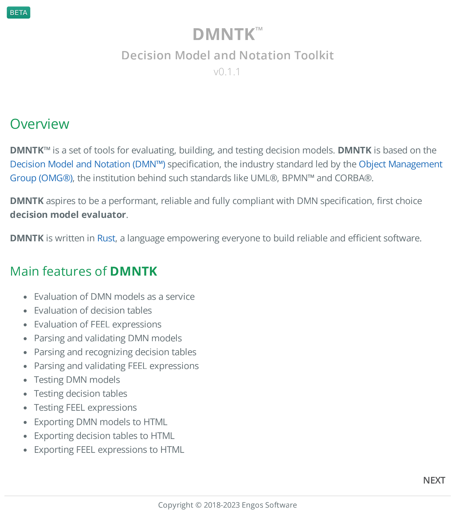
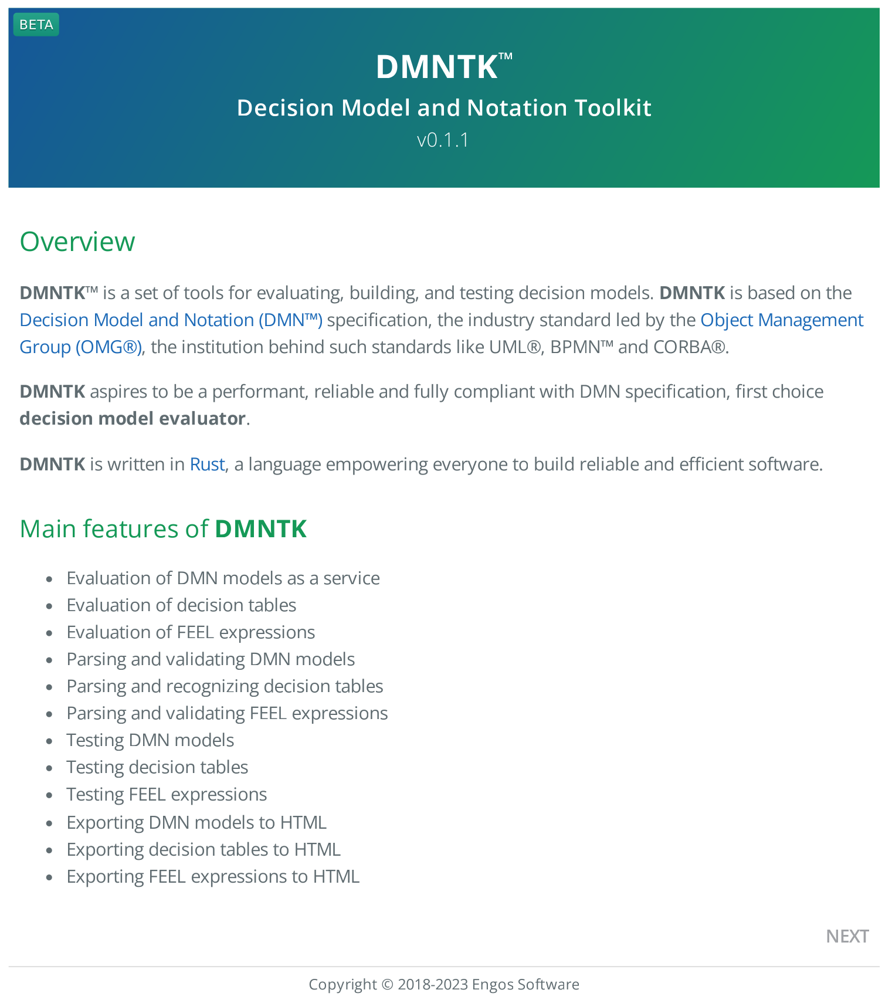
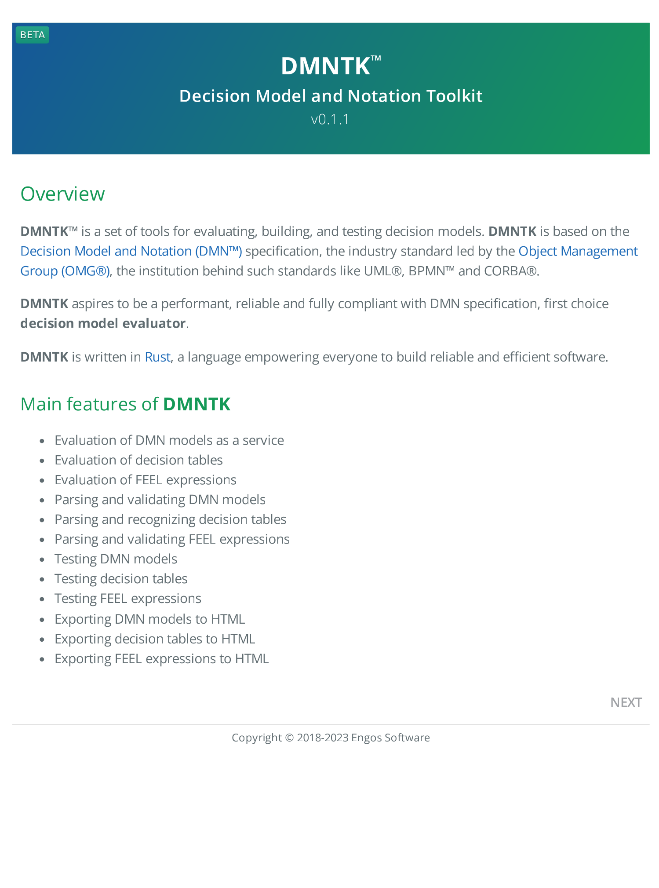
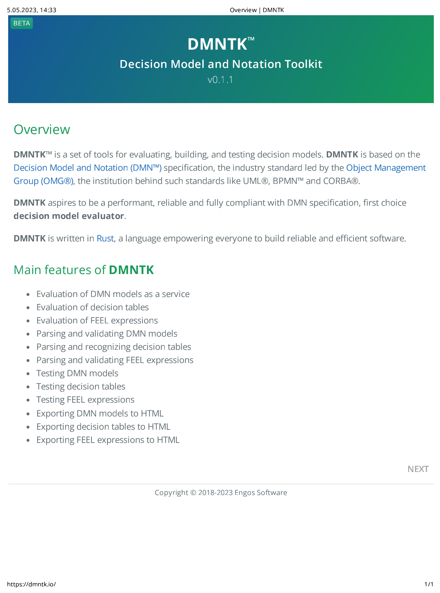
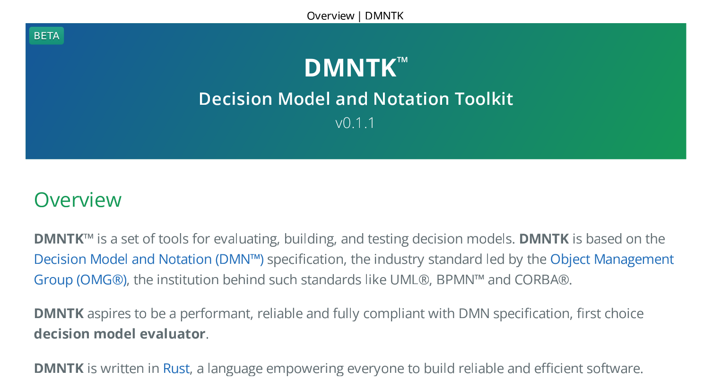
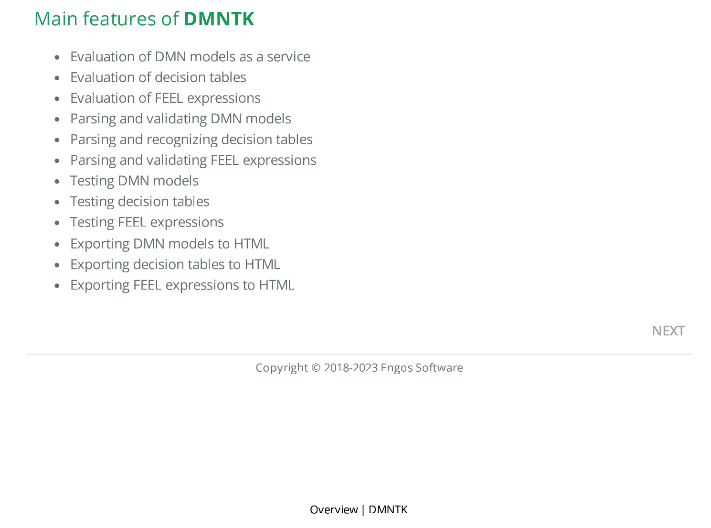

# User guide

(_still under continuous improvement_)

**htop** is a command-line tool for converting HTML (files or websites) into PDF files.

**htop** is based on [headless_chrome](https://crates.io/crates/headless_chrome) crate.
Initial version of **htop** was inspired by [html2pdf](https://crates.io/crates/html2pdf) crate.

In case of any problems while using **htop**, please see the [Troubleshooting](#Troubleshooting) section or report a bug.  

## Installation

To install **htop**, the [Rust](https://www.rust-lang.org) toolchain is required, get it [here](https://rustup.rs) when needed.

```
$ cargo install htop
```

## Usage

Display shortened usage description:

```bash
$ htop -h
```

Display detailed usage description:

```bash
$ htop --help
```

Display detailed description of a command:

```bash
$ htop help <command>
```

Display **htop** version:

```bash
$ htop -V
```

## Commands

### `single`

Converts single input HTML file into single output PDF file.

### `multiple`

Converts multiple input HTML files into multiple output PDF files.

### `url`

Converts single HTML page into PDF file.

## Options

### `-b --print-background`

When `-b` or `--print-background` option is present, the output PDF file will have the background preserved.
By default, HTML input files or pages are converted to PDF without the background.

Example **without background**:
```bash
$ htop url https://dmntk.io
```
Example **with background**:
```bash
$ htop -b url https://dmntk.io
```

|         without background          |            with background            |
|:-----------------------------------:|:-------------------------------------:|
|  |  |

### `--print-header-footer`

When `--print-header-footer` option is present, the output PDF file will contain a header and footer.
By default, Chromium prints its own headers and footers like in the example below.
Custom header and/or footer may be set using options `--header` or `--footer`.

Example **without header and footer**:
```bash
$ htop -b url https://dmntk.io
```
Example **with header and footer**:
```bash
$ htop -b --print-header-footer url https://dmntk.io
```

|         without header and footer          |            with header and footer            |
|:------------------------------------------:|:--------------------------------------------:|
|  |  |

### `--header` `--footer`

Options `--header` and `--footer` define custom HTML template for the print header and footer respectively.
This template must be valid HTML markup with the following classes used to inject printing values into them:
- **date** - formatted date of printing (system date),
- **title** - document title,
- **url** - document location,
- **pageNumber** - current page number,
- **totalPages** - total number of pages in the document.

Examples shown below generate **div** containing the title, centered in header and footer.

Example **with custom header**:
```bash
$ htop -b --header="<div style='width:100%;font-size:7pt;text-align:center;' class=title></div>" --print-header-footer url https://dmntk.io
```

Example **with custom footer**:
```bash
$ htop -b --footer="<div style='width:100%;font-size:7pt;text-align:center;' class=title></div>" --print-header-footer url https://dmntk.io
```

|            with custom header            |            with custom footer            |
|:----------------------------------------:|:----------------------------------------:|
|  |  |

### `--header-file` `--footer-file`

_tbd_

### `-l --landscape`

_tbd_

### `--margin`

_tbd_

### `-p --paper-format`

_tbd_

### `--paper-width`

_tbd_

### `--paper-height`

_tbd_

### `--ranges`

_tbd_

### `--scale`

_tbd_

### `-v --verbose`

_tbd_

### `--log-level`

_tbd_

### `--no-crash-reports`

_tbd_

### `-t --timeout`

_tbd_

## Troubleshooting

### Printing PDF hangs forever

When **htop** is used in multiuser environment (or in cloud), it may happen that the printing process hangs forever.
The reason is, that e.g., in Linux environment in directory **/tmp/Crashpad**, the crash report is created. 
When another user have already used **htop**, then such directory already exists with access rights
only for that user. Headless Chrome hangs while trying to get access to this directory.

The simplest workaround is to delete this directory before each **htop** run, e.g.:
```bash
$ sudo rm -rf /tmp/Crashpad 
```
but this will not work when multiple **htop** instances are started simultaneously.

To avoid creating the directory with crash reports, run all simultaneous instances of **htop** with ` --no-crash-reports` option, like this:
```bash
# htop --no-crash-reports url https://dmntk.io
```
